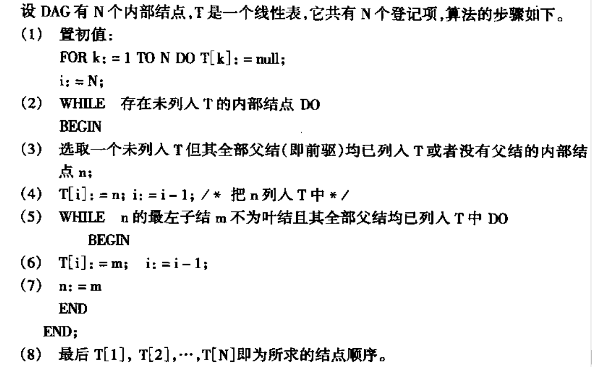

# 生成目标代码
目前已经得到了中间代码和符号表, 要将其转化为目标代码:
- 绝对机器语言
  - 二进制表示, 可以直接执行, 代码的存储位置和数据对象在内存中确定
- 可重定位机器语言
  - 连接装入后可以执行
- 汇编语言
  - 经过汇编程序汇编为可执行的机器代码

## 待用信息
某一个基本块中, `A`在`i`行的值由被`j`行引用, 中间没有关于`A`的赋值和引用, 则`j`为`i`的下一个引用点

## 代码生成
### 寄存器管理
- `Rvalue`: 每个寄存器中存储了哪些变量
- `Avalue`: 每个变量的值的存放位置

### 生成算法
对每一个四元式`(op, B, C, A)`
- 使用`get_reg()`函数获取一个保存`A`的值的寄存器`R`
- 访问`Avalue[B], Avalue[C]`, 获取`B`和`C`的值的地址`B'`和`C'`
- 如果`B'`/`C'`为`R`, 则将`Avalue[B]`/`Avalue[C]`中的`R`删去, 因为此`R`将被用来保存`A`
- 如果`B',C' != R`, 则首先将`B'`中的值加载进入`R`:
  - `ld R,B'`
- 运行op
  - `op R,C'`
- 令`Avalue[A] = {R}, Rvalue[R] = {A}`
- **处理完所有四元式后, 对于现行值在某寄存器`R`中的变量`M`, 如果`M`在出口之后仍然是活跃的, 那么生成`st R,M`, 将`M`写入主存**

注意, 该生成算法的四元式是一个基本块里的四元式, 和过程是独立的概念

## 寄存器分配
$$指令的执行代价 = 访问主存的次数+1$$
- `op R1,R2`, 代价为1
- `op R1,M`, 代价为2
- `op R1, *R2`, 代价为2
- `op R1,*M`, 代价为3

如果变量`x`获得一个固定分配的寄存器`R`, 那么之后的存取都在`R`中进行；如果没有, 则通过调用`get_reg()`动态获取寄存器
- 如果`x`的寄存器是`R`, 并且`x`在循环入口前活跃, 则进入循环前生成`ld R,x`
- 如果`x`的寄存器是`R`, 并且`x`在循环出口后活跃, 则退出循环后生成`st R,x`

### 重新排序
给DAG图中的节点重新排序, 尽可能使`A = X op Y op Z`中求完`X`的值就求`A`的值

